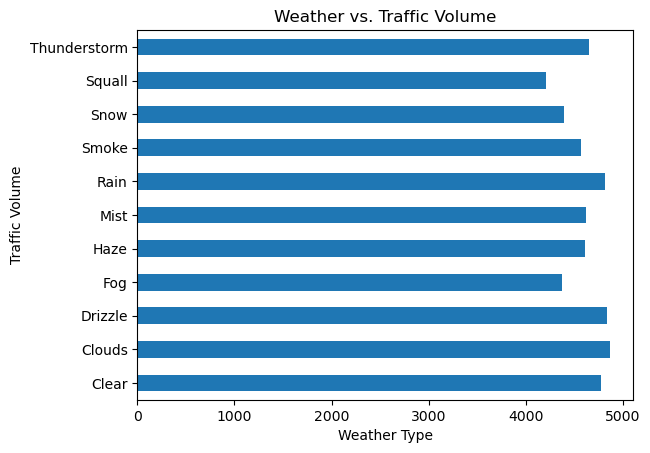

# Traffic Data Analysis

Analysis to determine indicators of heavy traffic on [Interstate 94.](https://en.wikipedia.org/wiki/Interstate_94) 

The goal of this analysis is to determine a few indicators of heavy traffic on I-94. These indicators can be weather type, time of the day, time of the week, etc. 

**Dataset**: Westbound traffic on the I-94 Interstate highway.

Reference: John Hogue made the dataset available, and you can download it from the [UCI Machine Learning Repository.](https://archive.ics.uci.edu/dataset/492/metro+interstate+traffic+volume)

EDA plots used in the analysis are below: 

Traffic Volume Histogram

 
 

Day vs. Night Traffic Volume

 
 

Monthly Traffic Volume

 
 

July Traffic (By Year)

 
 

Traffic Volume (Day of Week)

 
 

Hourly Traffic Volume (Weekdays vs. Weekends)

 
 

Weather vs. Traffic Volume

 
 

Weather Description vs. Traffic Volume

## Conclusion:

After exploring the I-94 dataset, we were able to find two key indicators of heavy traffic (specifically during the day):

 - **Time Indicators:**
     - Warmer months (March - October) resulted in heavier traffic compared to colder months (November - February)
     - Heavier traffic is expected during weekdays compared to weekends. 
     - On weekdays, peak hours look to be 7am and 4pm.

 - **Weather Indicators:**
    - Heavier traffic is expected during these weather conditions: 
    
        - Shower snow
        - Light rain and snow
        - Proximity thunderstorm with drizzle